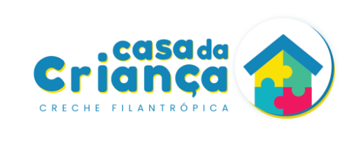

  

<h1 align="center">Casa da Criança de Pederneiras - Sistema de gestão de recebíveis</h1>

    
    

 

Este projeto é uma doação para a creche: <strong>Casa da Criança</strong> da cidade de pederneiras.

<h2>Como surgiu este projeto</h2>
Este projeto surgiu com a necessidade de implementação de um sistema digital para cadastramento de doadores, doações e recebíveis.

<h2>Sobre este projeto</h2>
Este projeto é um monorepo de um sistema de cadastramento de doadores, doações e recebíveis. 

Para a construção do front-end foi utilizado o framework <a href="https://nextjs.org/" target="_blank">Next.JS</a> utilizando o framework css: <a href="https://tailwindcss.com/" target="_blank">TailwindCSS</a>. 

Para o desenvolvimento do back-end foi utilizado a linguagem de programação: <a href="https://go.dev/" target="_blank">Go</a>.

Para o banco de dados foi escolhido o <a href="https://mariadb.org/" target="_blank">MariaDB</a> por ter sua licença GPL <a href="https://mariadb.com/kb/en/mariadb-licenses/" target="_blank">MariaDB License</a>.